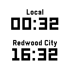

# tz-clock-layer

Pebble library for easily adding a clock with a secondary timezone (including automatic daylight savings) to your app.

Warning: Currently only supports a single instance.

Get your API key from [Timezone DB](https://timezonedb.com).

You can find a list of timezones here: [Timezone list](https://timezonedb.com/time-zones).



## Usage

`pebble package install ...`

````c
// This is a simple example, demonstrating the basic usage.
#include <tz-clock-layer/tz-clock-layer.h>

static TzClockLayer *s_remote_time_layer;

static void tick_handler(struct tm *tick_time, TimeUnits units_changed) {
  tz_clock_tick_event(s_remote_time_layer, tick_time, units_changed);
}

static void window_load(Window *window) {
  Layer *window_layer = window_get_root_layer(window);
  GRect bounds = layer_get_bounds(window_layer);

  s_remote_time_layer = tz_clock_layer_create(GRect(0, 68, bounds.size.w, 34), "YOUR-API-KEY", "America/Los_Angeles");
  layer_add_child(window_layer, s_remote_time_layer);

  tick_timer_service_subscribe(MINUTE_UNIT, tick_handler);
}

static void window_unload(Window *window) {
  tz_clock_layer_destroy(s_remote_time_layer);
}

````

## Additional Functions

Fairly standard text layer styling stuff.

    void tz_clock_layer_set_font(TzClockLayer *tz_clock_layer, GFont font);
    void tz_clock_layer_set_text_alignment(TzClockLayer *tz_clock_layer, GTextAlignment alignment);
    void tz_clock_layer_set_background_color(TzClockLayer *tz_clock_layer, GColor color);
    void tz_clock_layer_set_text_color(TzClockLayer *tz_clock_layer, GColor color);
    GSize tz_clock_layer_get_content_size(TzClockLayer *tz_clock_layer);
